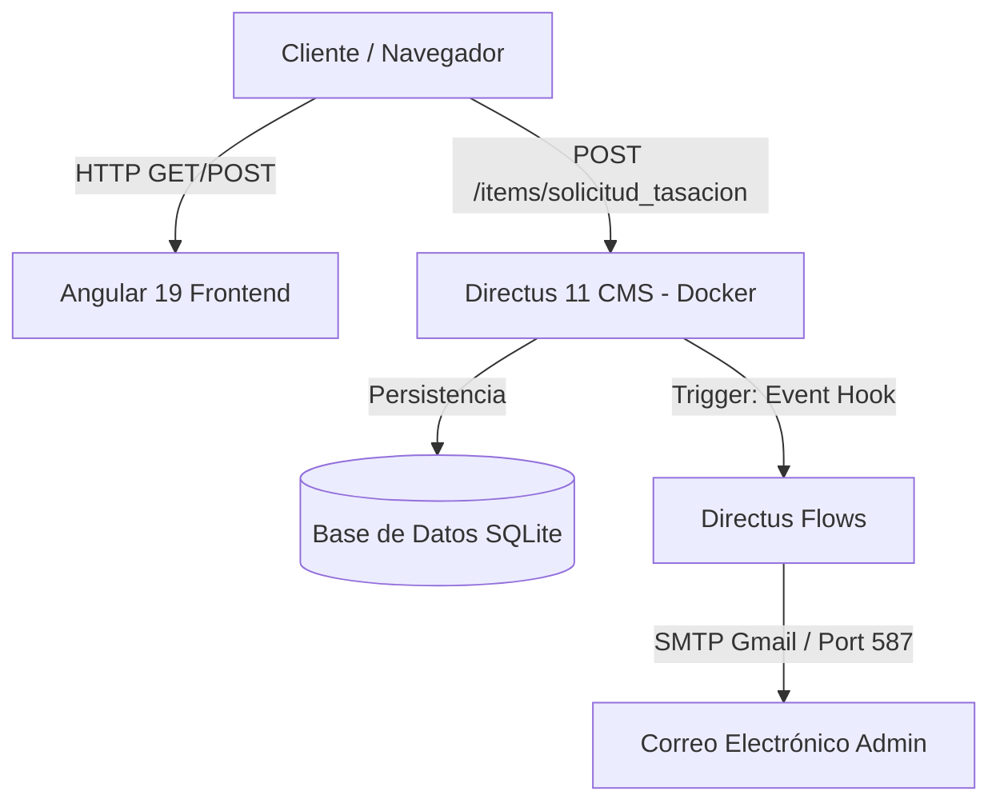

# 🚗 Automotora José Luis Jara — Sitio Web y CMS

Repositorio principal de la plataforma web de la **Automotora José Luis Jara**. La solución se compone de un frontend moderno desarrollado en **Angular 19** y un backend/CMS administrado con **Directus 11** desplegado mediante **Docker**.

---

## 📐 Arquitectura del Proyecto



### Tecnologías Principales:
* **Frontend**: Angular 19, RxJS, Tailwind CSS, Reactive Forms, Angular SSR (`server.ts`).
* **Backend / CMS**: Directus 11 (Headless CMS en Node.js).
* **Base de Datos**: SQLite (almacenada en volumen `./database/data.db`).
* **Infraestructura**: Docker & Docker Compose en VPS Linux.
* **Notificaciones**: Directus Flows + SMTP (Gmail).

---

## 📁 Estructura del Repositorio

```text
Automotora/
├── frontend/               # Aplicación cliente Angular 19
│   ├── src/
│   │   ├── app/
│   │   │   ├── core/      # Servicios (TasacionService, InventoryService)
│   │   │   ├── features/  # Vistas principales (Compramos tu auto, catálogo, etc.)
│   │   │   └── shared/    # Componentes reutilizables (Navbar, Footer, Slider)
│   │   └── server.ts      # Servidor Express para Angular SSR (opcional)
│   └── package.json
│
├── sistema-gestion/        # Backend CMS Directus
│   ├── database/          # Persistencia SQLite (volumen Docker)
│   ├── uploads/           # Imágenes y archivos adjuntos (volumen Docker)
│   ├── extensions/        # Extensiones personalizadas de Directus
│   ├── docker-compose.yml # Orquestación del contenedor Directus
│   ├── .env.example       # Plantilla de variables de entorno públicas
│   └── .env               # Variables de entorno privadas (Ignorado por Git)
│
└── README.md              # Documentación general del proyecto
```

---

## 🛠️ 1. Configuración del Backend (Directus + Docker)

### Requisitos Previos:
* Docker & Docker Compose instalados en tu sistema local o VPS.

### A. Variables de Entorno (`.env`)
En la carpeta `sistema-gestion/`, debes contar con un archivo `.env` (creado a partir de `.env.example`). **Nunca subas este archivo a GitHub**.

Ejemplo de contenido para `sistema-gestion/.env`:

```env
# General
PORT=8055
PUBLIC_URL="http://31.97.9.216:8055"

# Base de Datos SQLite (Persistida en Docker)
DB_CLIENT="sqlite3"
DB_FILENAME="./database/data.db"

# Archivos Subidos
STORAGE_LOCATIONS="local"
STORAGE_LOCAL_DRIVER="local"
STORAGE_LOCAL_ROOT="./uploads"

# Llaves de Seguridad y CORS
KEY="tu-clave-secreta-larga-y-aleatoria"
SECRET="tu-secreto-largo-y-aleatorio"
CORS_ENABLED="true"
CORS_ORIGIN="*"

# Usuario Administrador Inicial
ADMIN_EMAIL="admin@joseluisjara.cl"
ADMIN_PASSWORD="TuPasswordSeguro123"

# Configuración SMTP de Correo Electrónico
EMAIL_TRANSPORT="smtp"
EMAIL_SMTP_HOST="smtp.gmail.com"
EMAIL_SMTP_PORT=587
EMAIL_SMTP_USER="tu-correo@gmail.com"
EMAIL_SMTP_PASSWORD="tu-contrasena-de-aplicacion-gmail"
EMAIL_FROM="tu-correo@gmail.com"
```

> 💡 **Nota sobre Gmail SMTP**: El valor de `EMAIL_SMTP_PASSWORD` debe ser una **Contraseña de Aplicación de 16 caracteres** generada en la configuración de seguridad de tu cuenta de Google.

---

### B. Despliegue con Docker

Para iniciar el servicio en el servidor o entorno local:

```bash
# Entrar a la carpeta del backend
cd sistema-gestion

# Levantar el servicio en segundo plano (Detached mode)
docker compose up -d

# Ver los logs en tiempo real para verificar el estado de inicio
docker compose logs -f directus

# Detener el servicio manteniendo los datos intactos
docker compose down
```

Acceso al Panel Administrativo: `http://<IP-O-DOMINIO>:8055`

---

### C. Configuración del Envío de Correos Automático (Directus Flow)

Para enviar notificaciones cuando un usuario completa el formulario **"Compramos tu auto"**:

1. Ingresa al panel de Directus `http://<IP-O-DOMINIO>:8055`.
2. Ve a **Settings -> Flows** y crea un nuevo Flujo llamado `Notificación de Tasación`.
3. **Trigger**:
   - Tipo: `Event Hook`
   - Action: `Action (Non-Blocking)`
   - Scope: `items.create`
   - Collection: `solicitud_tasacion`
4. **Operation**:
   - Tipo: `Send Email`
   - To: `correo-destino@dominio.cl`
   - Subject: `Nueva Solicitud de Tasación — {{ $trigger.payload.marca }} {{ $trigger.payload.modelo }}`
   - Type: `WYSIWYG` (HTML)
   - Body: Plantilla de correo en HTML accediendo a `{{ $trigger.payload.campo }}`.
5. Cambia el estado del Flujo a **Active** y guarda.

---

## 💻 2. Configuración del Frontend (Angular 19)

### Requisitos Previos:
* Node.js v18+ y npm v9+

### A. Instalación y Ejecución en Desarrollo

```bash
# Entrar a la carpeta del frontend
cd frontend

# Instalar dependencias
npm install

# Iniciar servidor de desarrollo
npm start
# o
ng serve
```

La aplicación estará disponible en `http://localhost:4200/`.

---

### B. Integración con el Backend (Servicios)

El servicio `TasacionService` (`frontend/src/app/core/services/tasacion.service.ts`) gestiona la comunicación con la colección `solicitud_tasacion` de Directus:

```typescript
// Envío directo a la API de Directus
this.http.post('http://31.97.9.216:8055/items/solicitud_tasacion', payload);
```

---

### C. Compilación para Producción (SSR / Estático)

Para generar el paquete listo para producción:

```bash
# Compilar la aplicación en modo producción
npm run build

# Probar la versión compilada con el servidor Node/Express SSR
npm run serve:ssr:frontend
```

La compilación generará:
* `dist/frontend/browser`: Archivos estáticos optimizados.
* `dist/frontend/server`: Servidor Node.js Express para SSR.

---

## 🔒 3. Buenas Prácticas y Seguridad Git

* **Archivos excluidos de Git**: `.env`, `node_modules/`, `dist/`, `database/`, `uploads/`.
* **Subir cambios**: Modifica `.env.example` si agregas nuevas variables de entorno para documentarlas, pero **nunca guardes claves ni contraseñas reales en archivos subidos al repositorio**.

---

## 📞 Soporte y Mantenimiento

* **VPS Host**: Linux con Docker Compose.
* **Puerto Backend**: `8055`
* **Puerto Frontend Dev**: `4200`
